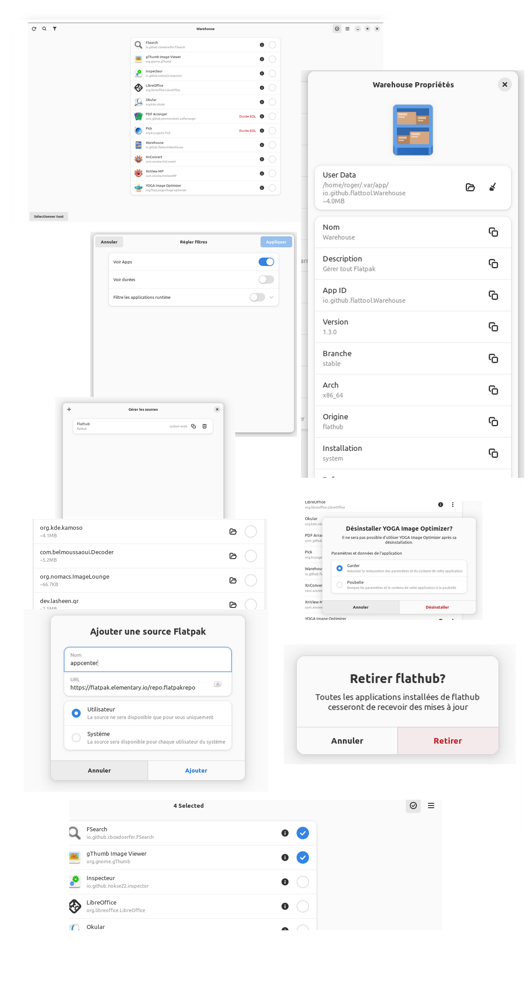

# 🛠️ Warehouse


## Warehouse est une boîte à outils polyvalente pour gérer les données de l'utilisateur flatpak, visualiser les informations sur les applications flatpak et gérer les flatpaks installés.

## 🚀 Caractéristiques principales:

1. **Visualisation des infos Flatpak:** 📋 peut afficher toutes les informations fournies par la liste flatpak dans une fenêtre graphique conviviale. Chaque élément comporte un bouton pour être facile à copier là où l'on en a besoin..

2. **Gestion des données de l'utilisateur:** 🗑️ Flatpaks stockent des données utilisateur dans un emplacement de système spécifique de votre sytème, souvent laissés-pour-vent lorsqu'une application est désinstallée. Warehouse peut désinstaller une application et supprimer ses données, supprimer des données sans désinstaller, ou simplement vous montrer si une application a des données d'utilisateur.
3. **Actions par lots:** ⚡ Warehouse dispose d'un mode de lot pour des installations rapides, de suppressions de données utilisateur et de copie d'identification d'une application en masse.

4. **Gestion des données de transfert:** 📁 Warehouse scanne le dossier de données de l'utilisateur pour vérifier la présence d'applications installées associées aux données. Si aucune n'est trouvée, il peut supprimer les données ou tenter d'installer un flatpak correspondant.

5. **Gérer les dépôts:** 📦 Les dépôts Flatpak installées et activées peuvent être supprimées, et de nouveaux dépôts peuvent aussi y être ajoutées.



## ⏬ Installation:

Warehouse est maintenant disponible sur Flathub Visitez votre magasin de logiciels et recherchez un entrepôt, ou cliquez sur ce badge.

<a href=https://flathub.org/apps/io.github.flattool.Warehouse></a>

## 🗣️ Traduction
- La traduction est hébergée avec Weblate on Fyra Labs, [cliquez ici](https://weblate.fyralabs.com/projects/flattool/warehouse/) pour y contribuer

<a href="https://weblate.fyralabs.com/engage/flattool/">

</a>

## 💬 Entrer en contact
- Nous avons un [serveur Discord](https://discord.gg/Sq85C42Xkt) et un [espace Matrix](https://matrix.to/#/#warehouse-development:matrix.org) pour y discuter et y envoyer des annonces!
- Vous pouvez toujours ouvrir des questions, des RP, et utiliser d'autres fonctionnalités de GitHub ici

## 📜 Code de Conduite
- Le projet Warehouse suit le [code de conduite GNOME](https://wiki.gnome.org/Foundation/CodeOfConduct). Voir `CODE_OF_CONDUCT.md` pour plus d'informations..

## ℹ️ Important Notes:
- Warehouse  suppose que les données de l'utilisateur flatpak sont situées dans le répertoire par défaut: `~/.var/app`.
- Warehouse ne vise pas à remplacer flatpak; il facilite simplement les commandes flatpak appropriées pour les actions souhaitées.
- Ce projet n'en est encore qu'à ses débuts, développé par un nouveau venu. Votre compréhension des bogues potentiels est grandement appréciée.

## 🛠️ Installation étapes à partir des référentiels:

1. Visitez la page [des versions](https://github.com/flattool/warehouse/releases) et téléchargez `io.github.flattool.Warehouse.flatpak`.
2. Installez-le à l'aide de votre logiciel ou exécutez la commande suivante : 
   ```shell
   flatpak install /path/to/io.github.flattool.Warehouse.flatpak
   ```
Lancez l'application en cliquant sur son icône dans votre menu app ou en exécutant votre application:
```shell
flatpak run io.github.flattool.Warehouse
```
